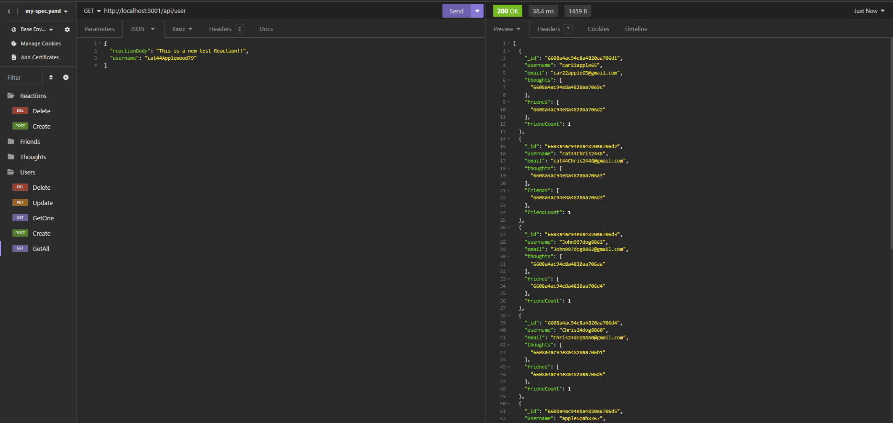

# Social-Network-Api

## Description

This is a social media api, that allows user to:

- Share a post (a thought). 
- Allows others to leave their own reaction to other thoughts. 
- It also includes a friend list that you are able to add and remove friends.

## Functions 

- The api is able to retireve all users, retrieve just one user based on an id, create an account, update an account's username and email, and delete an account.
- Is able to retrieve all thoughts, a single thought based on an id, allows users to create a thought, update the context of their thought, and delete a thought.
- Also, has a friend system so you are able to add friends based two users id, and are also able to remove a friend by the same manner.
- With each thought you are able to create a reaction to it, and are also able to delete them.

## Technologies Used

- Node.js (Backend Javascript Engine)
- MongoDb (Database)
- Mongoose (ODM)
- Express (Routing)

## Usage

- Before initiating the application you will have to download the dependencies through the command line with `npm i`.
- TO initiate the application run `npm start` through the command line.

## Video Demo

- You can view the demo [here](https://drive.google.com/file/d/1wmc9LvlBBwyJvSeLWzxz1agyVBlb7z8P/view?usp=sharing)